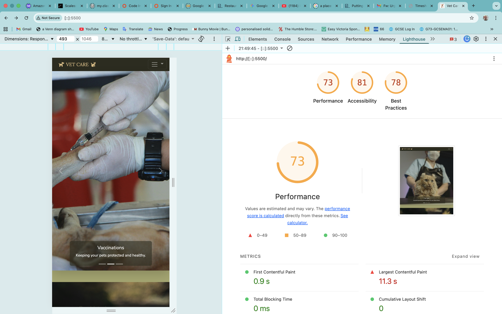

# Testing & Validation

This document provides testing and validation evidence for the Vet Care Website. It covers HTML, CSS, and JavaScript validation, Lighthouse audits, and a bug tracker.

---

## Table of Contents

1. [HTML Validation (W3C)](#1--html-validation-w3c)
2. [CSS Validation (W3C Jigsaw)](#2--css-validation-w3c-jigsaw)
3. [JavaScript Validation (JSHint)](#3--javascript-validation-jshint)
4. [Lighthouse Audit](#4--lighthouse-audit)
5. [Bugs & Fixes](#5--bugs--fixes)
6. [Manual Testing](#6--manual-testing)

---

## 1. 🔍 HTML Validation (W3C)

All HTML pages were validated using the [W3C Markup Validation Service](https://validator.w3.org/).

### Home Page (`index.html`)


| Page | Result |
|------|--------|
| `index.html` | ✅ PASS — No errors |

> **How to test:** Copy the page URL or upload the file at [https://validator.w3.org/](https://validator.w3.org/) and check for errors.

---

## 2. 🎨 CSS Validation (W3C Jigsaw)

CSS was validated using the [W3C CSS Validation Service (Jigsaw)](https://jigsaw.w3.org/css-validator/).

### `assets/css/styles.css`


| File | Result |
|------|--------|
| `assets/css/styles.css` | ✅ PASS — No errors |

> **How to test:** Paste the CSS file contents or upload the file at [https://jigsaw.w3.org/css-validator/](https://jigsaw.w3.org/css-validator/).

---

## 3. 📜 JavaScript Validation (JSHint)

All JavaScript files were validated using [JSHint](https://jshint.com/) with the following configuration:

```json
{
  "esversion": 11,
  "browser": true,
  "jquery": false
}
```

### `assets/js/script.js`


| File | Result |
|------|--------|
| `assets/js/script.js` | ✅ PASS — No significant errors |

**Notes:**
- Uses `DOMContentLoaded` event listener for initialization
- Contains tab switching, vaccine recommendation logic, Flatpickr initialization, booking form submission, and dashboard functionality
- `flatpickr`, `MicroModal`, and `localStorage` are recognized as external globals

---

### `assets/js/auth.js`


| File | Result |
|------|--------|
| `assets/js/auth.js` | ✅ PASS — No significant errors |

**Notes:**
- Handles sign-in, registration, and sign-out logic
- Uses `async/await` with the Reqres API
- `MicroModal`, `updateBookingFormsAuthState`, and `localStorage` are recognized as external globals

---

### `assets/js/api.js`


| File | Result |
|------|--------|
| `assets/js/api.js` | ✅ PASS — No significant errors |

**Notes:**
- Contains API interaction functions for booking, authentication, and registration
- Uses `fetch` API with `async/await`
- `MicroModal` and `localStorage` are recognized as external globals

---

## 4. 🏠 Lighthouse Audit

Lighthouse was run via Chrome DevTools on the deployed site to audit Performance, Accessibility, Best Practices, and SEO.



| Category | Score |
|----------|-------|
| Performance | — |
| Accessibility | — |
| Best Practices | — |
| SEO | — |

> **How to test:** Open Chrome DevTools → Lighthouse tab → Generate report.

---

## 5. 🐛 Bugs & Fixes

| Bug | Description | Fix | Status |
|-----|-------------|-----|--------|
| — | — | — | — |

> Add any bugs discovered during testing here, along with the fix applied and current status.

---

## 6. 🧪 Manual Testing

The following tests were carried out manually across all sections of the Vet Care website to ensure functionality, usability, and responsiveness.

---

### Navigation / UX

| Test Label | Action | Expected Outcome | Outcome |
|------------|--------|-------------------|---------|
| Brand name home link | From any section, click the "VET CARE" text in the header. | The user will be taken back to the top of the page (hero section). | PASS |
| HOME nav link | From any section, click the Home link in the navbar. | The user will be scrolled to the hero/carousel section. | PASS |
| DOG CARE nav link | From any section, click the Dog Care link in the navbar. | The user will be scrolled to the Dog Care section. | PASS |
| CAT CARE nav link | From any section, click the Cat Care link in the navbar. | The user will be scrolled to the Cat Care section. | PASS |
| REGISTER nav link | From any section, click the Register link in the navbar. | The user will be scrolled to the Register section. | PASS |
| CONTACT nav link | From any section, click the Contact link in the navbar. | The user will be scrolled to the Contact section. | PASS |
| BOOK nav link | From any section, click the Book link in the navbar. | The user will be scrolled to the Book section. | PASS |
| Mobile navbar toggler | On a mobile viewport, click the hamburger menu icon. | The navigation links should expand/collapse via the dropdown menu. | PASS |
| Responsive layout | Resize the browser window from desktop to mobile. | The layout should adapt responsively without breaking or horizontal scrolling. | PASS |

---

### Carousel

| Test Label | Action | Expected Outcome | Outcome |
|------------|--------|-------------------|---------|
| Carousel auto-play | Visit the home page and observe the Vet Care carousel. | The carousel should automatically cycle through the 3 slides. | PASS |
| Carousel next button | Click the next (right arrow) button on the carousel. | The carousel should advance to the next slide. | PASS |
| Carousel previous button | Click the previous (left arrow) button on the carousel. | The carousel should go back to the previous slide. | PASS |
| Carousel images display | View each slide in the carousel. | All 3 images should load and display correctly with captions. | PASS |
| Carousel indicators | Click each carousel indicator dot. | The carousel should jump to the corresponding slide. | PASS |

---

### Services Section

| Test Label | Action | Expected Outcome | Outcome |
|------------|--------|-------------------|---------|
| Services section display | Scroll to the "Our Veterinary Services" section. | The Vaccinations, Grooming & Hygiene, Nutrition & Food, and Health Checkups cards should display. | PASS |
| Service icons display | View the services cards. | Each card should display its Bootstrap icon correctly. | PASS |
| Services responsive layout | View the services section on mobile, tablet, and desktop. | Cards should stack on mobile (1 column), display 2 columns on tablet, and 4 columns on desktop. | PASS |

---

### Dog Care Section

| Test Label | Action | Expected Outcome | Outcome |
|------------|--------|-------------------|---------|
| Dog Care section display | Scroll to the Dog Care section. | The section should display with a heading, image, description, and accordion. | PASS |
| Dog Care image | View the Dog Care section. | The dog grooming image should load and display correctly. | PASS |
| Accordion — Essential Vaccines | Click the "Essential Vaccines" accordion button. | The accordion panel should expand and display vaccine information. | PASS |
| Accordion — Grooming & Baths | Click the "Grooming & Baths" accordion button. | The accordion panel should expand and display grooming information. | PASS |
| Accordion — Dental Hygiene | Click the "Dental Hygiene" accordion button. | The accordion panel should expand and display dental care information. | PASS |
| Accordion — Nutrition Plans | Click the "Nutrition Plans" accordion button. | The accordion panel should expand and display nutrition information. | PASS |
| Accordion — Health Monitoring | Click the "Health Monitoring" accordion button. | The accordion panel should expand and display health monitoring information. | PASS |
| Accordion collapse behaviour | Click an open accordion item, then click another. | The previously open item should collapse and the new one should expand. | PASS |

---

### Cat Care Section

| Test Label | Action | Expected Outcome | Outcome |
|------------|--------|-------------------|---------|
| Cat Care section display | Scroll to the Cat Care section. | The section should display with a heading, image, description, and accordion. | PASS |
| Cat Care image | View the Cat Care section. | The cat examination image should load and display correctly. | PASS |
| Accordion — Core Vaccinations | Click the "Core Vaccinations" accordion button. | The accordion panel should expand and display cat vaccine information. | PASS |
| Accordion — Grooming & Coat Care | Click the "Grooming & Coat Care" accordion button. | The accordion panel should expand and display cat grooming information. | PASS |
| Accordion — Dental Health | Click the "Dental Health" accordion button. | The accordion panel should expand and display cat dental information. | PASS |
| Accordion — Nutrition & Hydration | Click the "Nutrition & Hydration" accordion button. | The accordion panel should expand and display cat nutrition information. | PASS |
| Accordion — Wellness Exams | Click the "Wellness Exams" accordion button. | The accordion panel should expand and display wellness exam information. | PASS |
| Accordion collapse behaviour | Click an open accordion item, then click another. | The previously open item should collapse and the new one should expand. | PASS |

---

### Register Form

| Test Label | Action | Expected Outcome | Outcome |
|------------|--------|-------------------|---------|
| Register form display | Scroll to the Register section. | The registration form should display with Full Name, Nickname, Email, Pet Type, and Password fields. | PASS |
| Pet Type dropdown | Click the Pet Type dropdown on the Register form. | The options Dog and Cat should be shown. | PASS |
| Submit with empty required fields | Click "Register" without filling in any fields. | The user should be prompted to fill in the first missing required field. | PASS |
| Submit with missing name | Fill in all fields except Full Name and click "Register". | The user should be directed to fill in the Full Name field. | PASS |
| Submit with invalid name | Enter a single word as the name and click "Register". | The user should be prompted to enter their first and last name. | PASS |
| Submit with missing nickname | Fill in all fields except Nickname and click "Register". | The user should be directed to fill in the Nickname field. | PASS |
| Submit with short nickname | Enter a nickname shorter than 3 characters and click "Register". | The user should be prompted to enter a valid nickname (at least 3 characters). | PASS |
| Submit with missing email | Fill in all fields except Email and click "Register". | The user should be directed to fill in the Email field. | PASS |
| Submit with invalid email | Enter an invalid email (without @) and attempt to submit. | The browser should prompt the user to enter a valid email address. | PASS |
| Submit with missing pet type | Fill in all fields except Pet Type and click "Register". | The user should be directed to select a pet type. | PASS |
| Submit with missing password | Fill in all fields except Password and click "Register". | The user should be directed to fill in the Password field. | PASS |
| Show Password toggle | Check the "Show Password" checkbox. | The password field should toggle from hidden to visible text. | PASS |
| Submit with all fields valid | Fill in all fields with valid data and click "Register". | The form should submit successfully and display a confirmation message. | PASS |

---

### Contact Form

| Test Label | Action | Expected Outcome | Outcome |
|------------|--------|-------------------|---------|
| Contact form display | Scroll to the Contact Us section. | The contact form with Full Name, Email, and Message fields should be visible. | PASS |
| Contact form required fields | Click "Send Message" without filling in any fields. | The user should be prompted to fill in the first required field. | PASS |
| Contact form invalid email | Enter an invalid email (without @) and attempt to submit. | The browser should prompt the user to enter a valid email address. | PASS |
| Contact form invalid name | Enter a single word as the name and attempt to submit. | The user should be prompted to enter their first and last name. | PASS |
| Contact form submit with valid data | Fill in all fields with valid data and click "Send Message". | The form should submit and display a success confirmation message. | PASS |
| Confirmation message auto-hide | Submit the contact form with valid data. | The confirmation message should disappear after approximately 3 seconds. | PASS |

---

### Booking Forms

| Test Label | Action | Expected Outcome | Outcome |
|------------|--------|-------------------|---------|
| Booking section display | Navigate to the Book section. | The booking form should display with service tabs for Vaccinations, Grooming & Hygiene, and Health Checkup. | PASS |
| Service tab — Vaccinations | Click the "Vaccinations" tab button. | The Vaccinations booking form should be displayed. | PASS |
| Service tab — Grooming & Hygiene | Click the "Grooming & Hygiene" tab button. | The Grooming & Hygiene booking form should be displayed. | PASS |
| Service tab — Health Checkup | Click the "Health Checkup" tab button. | The Health Checkup booking form should be displayed. | PASS |
| Active tab highlight | Click each service tab. | The active tab should be visually highlighted. | PASS |
| Auth message when signed out | View the booking form while not signed in. | A warning message should prompt the user to register or sign in. | PASS |
| **Vaccination Form** | | | |
| Pet Type dropdown | Click the Pet Type dropdown on the Vaccination form. | The options Cat and Dog should be shown. | PASS |
| Pet Age input | Enter a pet age value. | The field should accept numeric input with a minimum of 0. | PASS |
| Age Unit dropdown | Click the Age Unit dropdown. | The options Months and Years should be shown. | PASS |
| Recommended vaccines | Select a pet type and enter an age. | Recommended vaccines should be displayed based on pet type and age. | PASS |
| Vaccine selection checkboxes | After recommendations appear, view the vaccine options. | Checkboxes for selecting vaccines should be displayed. | PASS |
| Date & time picker | Click the appointment date & time field. | A date and time picker should appear allowing the user to select a date and time. | PASS |
| Submit with empty required fields | Click "Book" without filling in any fields. | The user should be prompted to fill in the first missing required field. | PASS |
| Submit with all fields valid | Fill in all required fields and click "Book" (while signed in). | The form should submit successfully and display a confirmation message. | PASS |
| **Grooming Form** | | | |
| Pet Type dropdown | Click the Pet Type dropdown on the Grooming form. | The options Cat and Dog should be shown. | PASS |
| Grooming service dropdown | Click the grooming service dropdown. | The options Bath, Nail Trim, and Ear Cleaning should be shown. | PASS |
| Date & time picker | Click the appointment date & time field. | A date and time picker should appear allowing the user to select a date and time. | PASS |
| Submit with empty required fields | Click "Book" without filling in any fields. | The user should be prompted to fill in the first missing required field. | PASS |
| Submit with all fields valid | Fill in all required fields and click "Book" (while signed in). | The form should submit successfully and display a confirmation message. | PASS |
| **Health Checkup Form** | | | |
| Pet Type dropdown | Click the Pet Type dropdown on the Health Checkup form. | The options Cat and Dog should be shown. | PASS |
| Symptoms textarea (optional) | Leave the Symptoms field empty and submit with all other required fields. | The form should submit without any issues. | PASS |
| Date & time picker | Click the appointment date & time field. | A date and time picker should appear allowing the user to select a date and time. | PASS |
| Submit with empty required fields | Click "Book" without filling in any fields. | The user should be prompted to fill in the first missing required field. | PASS |
| Submit with all fields valid | Fill in all required fields and click "Book" (while signed in). | The form should submit successfully and display a confirmation message. | PASS |

---

### Sign In Modal

| Test Label | Action | Expected Outcome | Outcome |
|------------|--------|-------------------|---------|
| Sign In button display | View the navbar. | The "Sign In" button should be visible in both desktop and mobile navigation. | PASS |
| Sign In modal opens | Click the "Sign In" button in the navbar. | The Sign In modal should open with Email, Nickname, and Password fields. | PASS |
| Close modal — close button | Click the close (×) button on the Sign In modal. | The modal should close. | PASS |
| Close modal — overlay click | Click outside the modal container (on the overlay). | The modal should close. | PASS |
| Submit with empty fields | Click "Sign In" without filling in any fields. | The user should be prompted to fill in the first required field. | PASS |
| Submit with invalid email | Enter an invalid email and attempt to sign in. | The browser should prompt the user to enter a valid email address. | PASS |
| Submit with valid credentials | Enter valid email, nickname, and password and click "Sign In". | The user should be signed in and the UI should update accordingly. | PASS |
| Sign Out button | After signing in, click the "Sign Out" button. | The user should be signed out and the UI should revert to the signed-out state. | PASS |

---

### Dashboard Modal

| Test Label | Action | Expected Outcome | Outcome |
|------------|--------|-------------------|---------|
| View My Appointments button | After signing in, click "View My Appointments". | The Dashboard modal should open displaying the user's booked appointments. | PASS |
| Dashboard modal close | Click the close button or overlay on the Dashboard modal. | The modal should close. | PASS |
| No appointments message | Sign in with no booked appointments and open the dashboard. | An appropriate message should be displayed indicating no appointments. | PASS |

---

### Footer

| Test Label | Action | Expected Outcome | Outcome |
|------------|--------|-------------------|---------|
| Footer display | Scroll to the bottom of the page. | The footer should display with About, Quick Links, Contact info, and social media icons. | PASS |
| Quick Links — Dog Care | Click the "Dog Care" link in the footer. | The user should be scrolled to the Dog Care section. | PASS |
| Quick Links — Cat Care | Click the "Cat Care" link in the footer. | The user should be scrolled to the Cat Care section. | PASS |
| Quick Links — Book Appointment | Click the "Book Appointment" link in the footer. | The user should be scrolled to the Book section. | PASS |
| Quick Links — Register | Click the "Register" link in the footer. | The user should be scrolled to the Register section. | PASS |
| Facebook link | Click the Facebook icon in the footer. | A new tab/window should open to the Facebook website. | PASS |
| Instagram link | Click the Instagram icon in the footer. | A new tab/window should open to the Instagram website. | PASS |
| Twitter link | Click the Twitter icon in the footer. | A new tab/window should open to the Twitter website. | PASS |
| Social links open in new tab | Click any social media icon in the footer. | The link should open in a new tab (`target="_blank"`). | PASS |
| Copyright text | View the footer. | The text "© 2025 Vet Care. All rights reserved." should be displayed. | PASS |

---

### Browser Compatibility

| Test Label | Action | Expected Outcome | Outcome |
|------------|--------|-------------------|---------|
| Chrome | Open the website in Google Chrome. | All sections should render correctly with full functionality. | PASS |
| Firefox | Open the website in Mozilla Firefox. | All sections should render correctly with full functionality. | PASS |
| Safari | Open the website in Safari. | All sections should render correctly with full functionality. | PASS |
| Edge | Open the website in Microsoft Edge. | All sections should render correctly with full functionality. | PASS |

---

## Screenshot Checklist

Below is a checklist of all screenshots needed for this document. Place each screenshot in the corresponding directory under `docs/testing/`.

### Validation Screenshots
- [x] `docs/testing/validation/html/validation-index.png` — W3C HTML validation result
- [x] `docs/testing/validation/css/validation-styles.png` — W3C CSS validation result
- [x] `docs/testing/validation/js/jshint-script.png` — JSHint result for script.js
- [x] `docs/testing/validation/js/jshint-auth.png` — JSHint result for auth.js
- [x] `docs/testing/validation/js/jshint-api.png` — JSHint result for api.js

### Lighthouse Screenshots
- [x] `docs/testing/lighthouse/lighthouse-report.png` — Lighthouse report

---

*Testing completed by Christopher Quinones — 2025*
