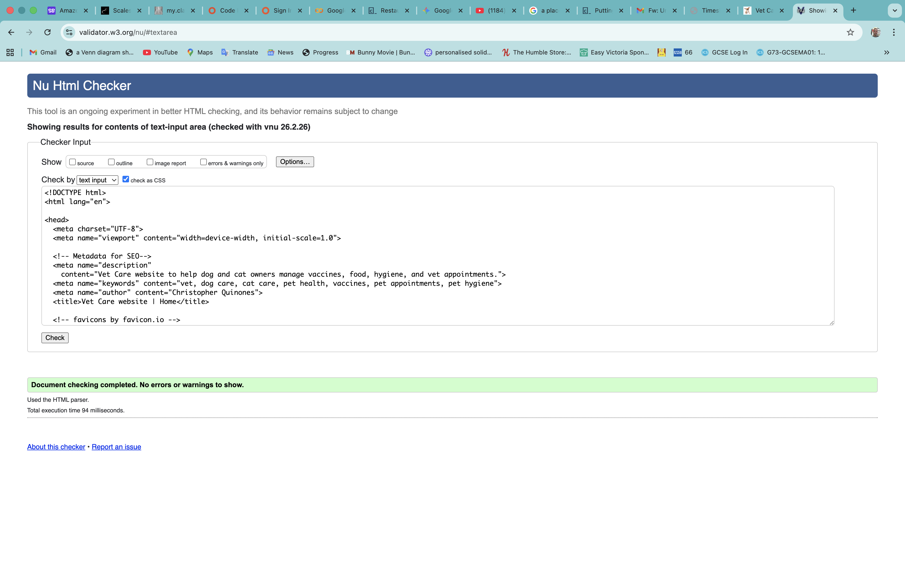
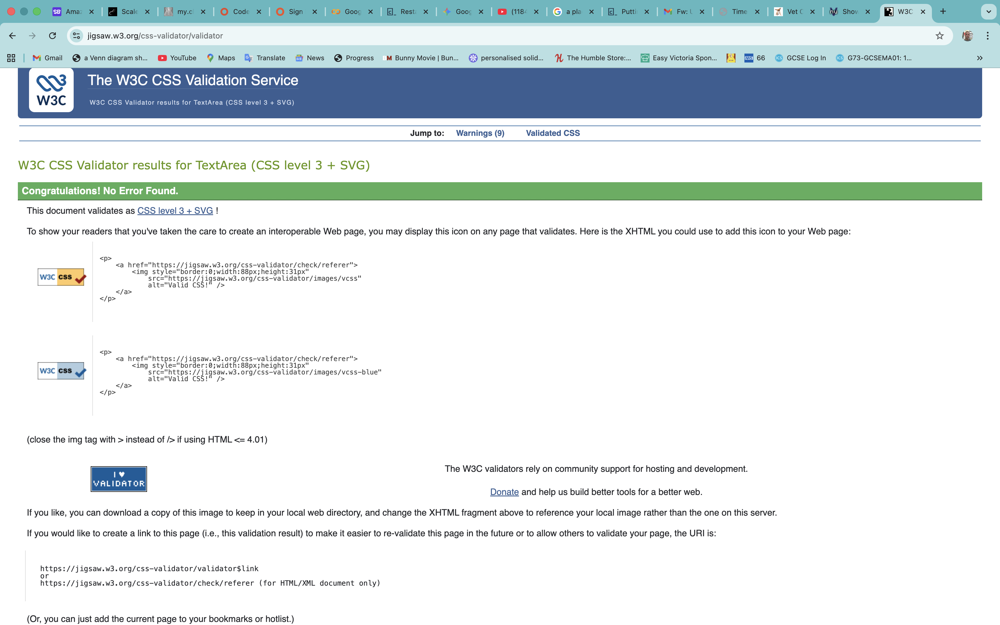
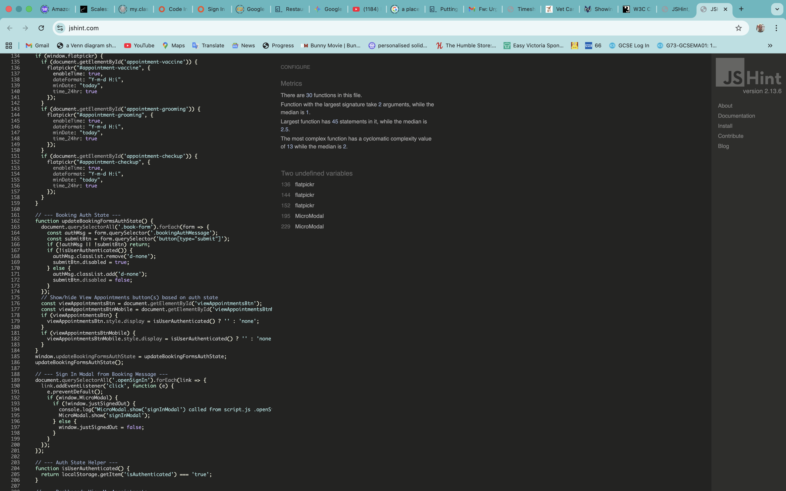
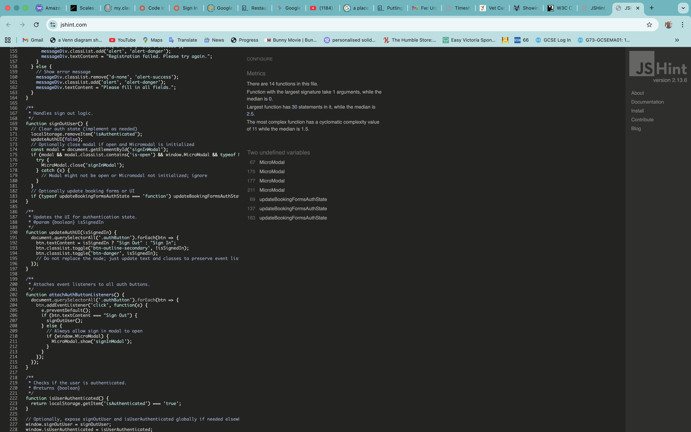
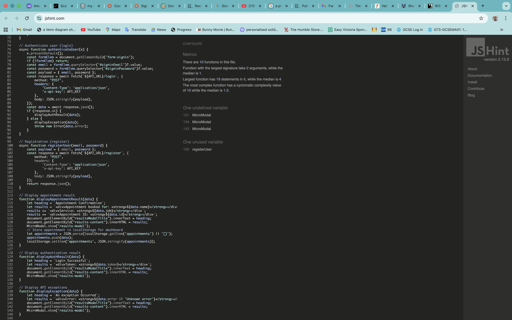

# Testing & Validation

This document provides testing and validation evidence for the Vet Care Website. It covers HTML, CSS, and JavaScript validation, Lighthouse audits, and a bug tracker.

---

## Table of Contents

1. [HTML Validation (W3C)](#1--html-validation-w3c)
2. [CSS Validation (W3C Jigsaw)](#2--css-validation-w3c-jigsaw)
3. [JavaScript Validation (JSHint)](#3--javascript-validation-jshint)
4. [Lighthouse Audit](#4--lighthouse-audit)
5. [Bugs & Fixes](#5--bugs--fixes)

---

## 1. 🔍 HTML Validation (W3C)

All HTML pages were validated using the [W3C Markup Validation Service](https://validator.w3.org/).

### Home Page (`index.html`)



| Page | Result |
|------|--------|
| `index.html` | ✅ PASS — No errors |

> **How to test:** Copy the page URL or upload the file at [https://validator.w3.org/](https://validator.w3.org/) and check for errors.

---

## 2. 🎨 CSS Validation (W3C Jigsaw)

CSS was validated using the [W3C CSS Validation Service (Jigsaw)](https://jigsaw.w3.org/css-validator/).

### `assets/css/styles.css`



| File | Result |
|------|--------|
| `assets/css/styles.css` | ✅ PASS — No errors |

> **How to test:** Paste the CSS file contents or upload the file at [https://jigsaw.w3.org/css-validator/](https://jigsaw.w3.org/css-validator/).

---

## 3. 📜 JavaScript Validation (JSHint)

All JavaScript files were validated using [JSHint](https://jshint.com/) with the following configuration:

```json
{
  "esversion": 11,
  "browser": true,
  "jquery": false
}
```

### `assets/js/script.js`



| File | Result |
|------|--------|
| `assets/js/script.js` | ✅ PASS — No significant errors |

**Notes:**
- Uses `DOMContentLoaded` event listener for initialization
- Contains tab switching, vaccine recommendation logic, Flatpickr initialization, booking form submission, and dashboard functionality
- `flatpickr`, `MicroModal`, and `localStorage` are recognized as external globals

---

### `assets/js/auth.js`



| File | Result |
|------|--------|
| `assets/js/auth.js` | ✅ PASS — No significant errors |

**Notes:**
- Handles sign-in, registration, and sign-out logic
- Uses `async/await` with the Reqres API
- `MicroModal`, `updateBookingFormsAuthState`, and `localStorage` are recognized as external globals

---

### `assets/js/api.js`



| File | Result |
|------|--------|
| `assets/js/api.js` | ✅ PASS — No significant errors |

**Notes:**
- Contains API interaction functions for booking, authentication, and registration
- Uses `fetch` API with `async/await`
- `MicroModal` and `localStorage` are recognized as external globals

---

## 4. 🏠 Lighthouse Audit

Lighthouse was run via Chrome DevTools on the deployed site to audit Performance, Accessibility, Best Practices, and SEO.

### Desktop


| Category | Score |
|----------|-------|
| Performance | — |
| Accessibility | — |
| Best Practices | — |
| SEO | — |

### Mobile


| Category | Score |
|----------|-------|
| Performance | — |
| Accessibility | — |
| Best Practices | — |
| SEO | — |

> **How to test:** Open Chrome DevTools → Lighthouse tab → Generate report for both Mobile and Desktop.

---

## 5. 🐛 Bugs & Fixes

| Bug | Description | Fix | Status |
|-----|-------------|-----|--------|
| — | — | — | — |

> Add any bugs discovered during testing here, along with the fix applied and current status.

---

## Screenshot Checklist

Below is a checklist of all screenshots needed for this document. Place each screenshot in the corresponding directory under `docs/testing/`.

### Validation Screenshots
- [x] `docs/testing/validation/html/validation-index.png` — W3C HTML validation result
- [x] `docs/testing/validation/css/validation-styles.png` — W3C CSS validation result
- [x] `docs/testing/validation/js/jshint-script.png` — JSHint result for script.js
- [x] `docs/testing/validation/js/jshint-auth.png` — JSHint result for auth.js
- [x] `docs/testing/validation/js/jshint-api.png` — JSHint result for api.js

### Lighthouse Screenshots
- [ ] `docs/testing/lighthouse/lighthouse-desktop.png` — Lighthouse desktop report
- [ ] `docs/testing/lighthouse/lighthouse-mobile.png` — Lighthouse mobile report

---

*Testing completed by Christopher Quinones — 2025*
